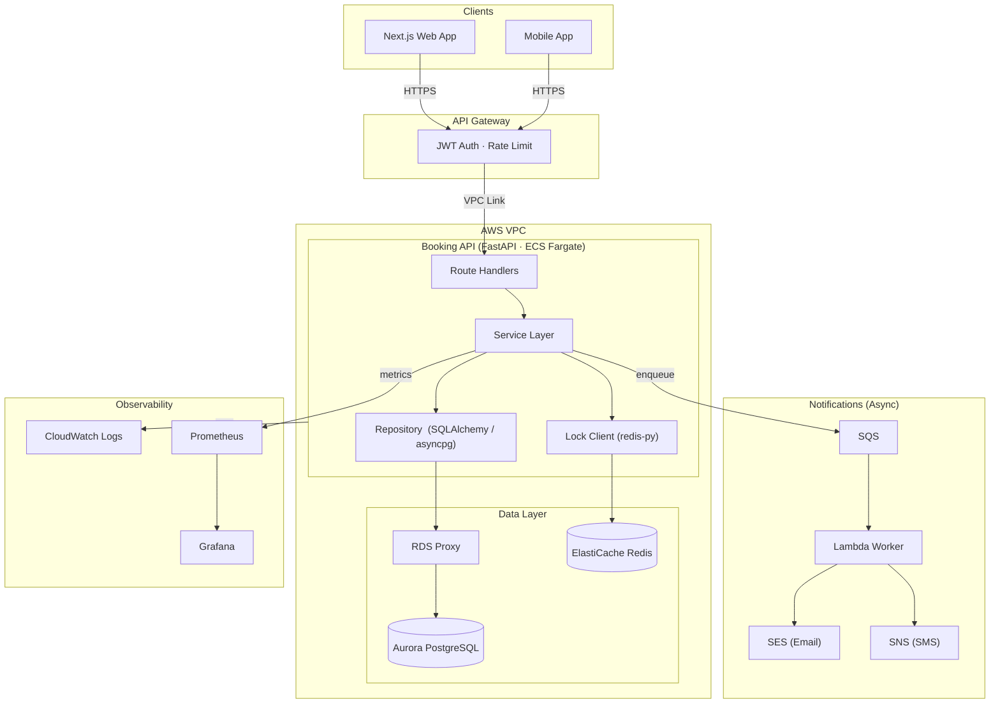

# Diagram 01 — System Architecture

## Component Roles

| Component | Role |
|-----------|------|
| **Next.js Web App** | TypeScript-first SSR React app. Hosted on AWS Amplify with CloudFront CDN. Thin client — all booking logic is server-side. |
| **Mobile App** | Native iOS/Android; consumes the same REST API. |
| **AWS API Gateway (HTTP API)** | Managed ingress. JWT authorizer validates tokens without a DB roundtrip. Rate limiting at the stage level. Routes requests to the ECS service via VPC Link. |
| **ECS Fargate — Booking API** | Core domain service (Python / FastAPI). Stateless; two tasks behind an ALB enable rolling deploys. Owns all booking logic: validation, availability check, lock, DB write, SQS publish. |
| **SQLAlchemy 2 / asyncpg** | Async ORM + driver. Keeps the FastAPI event loop unblocked on DB calls. Alembic manages schema migrations. |
| **redis-py (asyncio)** | Issues `SET NX PX` commands against ElastiCache to acquire per-slot distributed locks. |
| **RDS Proxy** | Pools and multiplexes DB connections. Prevents connection exhaustion as ECS task count scales. |
| **Aurora PostgreSQL Serverless v2** | Source of truth. Auto-scales ACUs. ACID transactions guarantee booking consistency. GIN indexes for skill matching. Exclusion constraints as final booking backstop. |
| **ElastiCache Serverless (Redis)** | Distributed locks (booking atomicity), availability slot cache (60 s), idempotency key cache (24 h). Multi-AZ managed automatically. |
| **Amazon SQS** | Durable notification queue. Standard queue with DLQ captures messages that fail after 5 attempts. Decouples notification delivery from the booking critical path. |
| **Lambda Notification Worker** | Python Lambda triggered by SQS. Sends confirmation email via SES and SMS via SNS. Scales automatically with queue depth. |
| **Amazon SES / SNS** | AWS-native email and SMS delivery. Credentials managed via IAM role — no hardcoded secrets. |
| **CloudWatch Logs** | Structured log ingestion. ECS ships stdout automatically via the `awslogs` driver. CloudWatch Log Insights for ad-hoc queries. |
| **Prometheus** | Scrapes the `/metrics` endpoint on the FastAPI app. Stores time-series metrics for bookings, latency, and lock contention. |
| **Grafana** | Dashboards connected to Prometheus. Alert rules notify on-call for high rejection rate, P99 latency breach, and SQS DLQ depth. |
