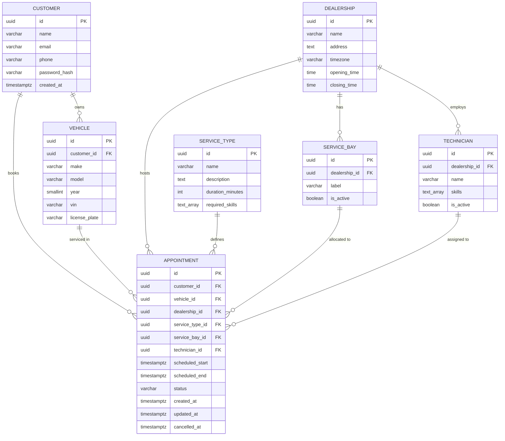

# Diagram 02 — Entity Relationship

## Key Constraints

| Constraint | Enforcement |
|-----------|-------------|
| `vehicle.customer_id = appointment.customer_id` | Application layer + FK |
| `service_bay.dealership_id = appointment.dealership_id` | Application layer + FK |
| `technician.dealership_id = appointment.dealership_id` | Application layer + FK |
| `technician.skills @> service_type.required_skills` | Application layer + GIN index query |
| No overlapping CONFIRMED appointments per bay | Exclusion constraint (`tstzrange && WITH gist`) |
| No overlapping CONFIRMED appointments per technician | Exclusion constraint (`tstzrange && WITH gist`) |
