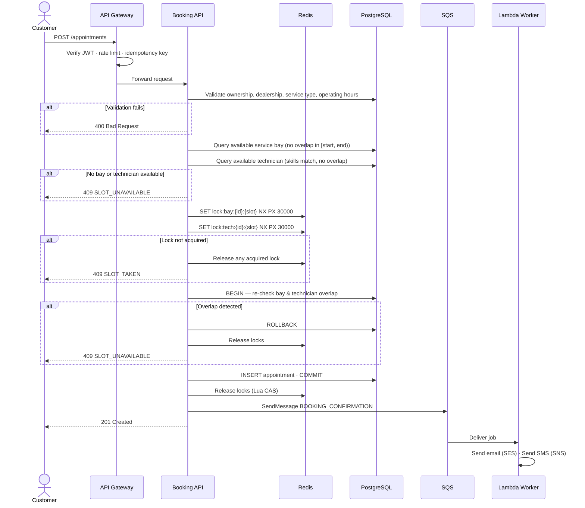

# Diagram 03 — Booking Flow (Sequence)

End-to-end sequence for a successful appointment booking and the two main failure paths.

## Notes

- **Idempotency**: If the customer retries with the same `Idempotency-Key` header,
  ElastiCache returns the cached `201` response without re-executing booking logic.
- **Lock TTL**: The 30-second TTL ensures locks are released even if the ECS task crashes
  mid-transaction. The Aurora exclusion constraint provides a final backstop in that case.
- **Notification decoupling**: A Lambda failure does not affect booking confirmation.
  SQS retries delivery up to 5 times; undeliverable messages land in the DLQ.
