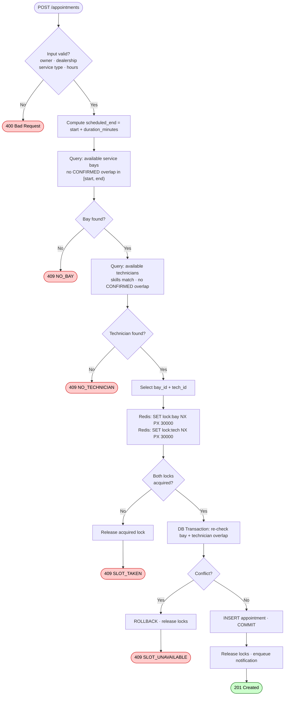

# Diagram 04 — Availability Check (Flowchart)

Decision logic executed on every `POST /appointments` request before any lock or write.

## Decision Points Summary

| Gate | Check | Failure Response |
|------|-------|-----------------|
| **Input validation** | Schema, ownership, temporal bounds | 400 Bad Request |
| **Bay availability** | DB overlap query (`scheduled_start < end AND scheduled_end > start`) | 409 No Bay |
| **Technician availability** | DB overlap query + skill match (`skills @> required_skills`) | 409 No Technician |
| **Distributed lock** | Redis `SET NX` for bay + technician | 409 Slot Taken (concurrent) |
| **DB re-check** | Repeat overlap query inside transaction | 409 Slot Unavailable (race) |
| **DB constraint** | PostgreSQL exclusion constraint on `tstzrange` | 500 → alert (should never fire) |
